% HTML CSS Javascript
%
% Formation HTML CSS Javascript CS - 2016 - Arnaud Tournier - LTE Consulting

## HTML

## HTML - Introduction

HTML (HyperText Markup Language) est un format de présentation de données permettant de créer des pages web lues dans des navigateurs. 

C'est un langage de description de données et non de programmation. Une fois le document chargé dans le navigateur, il ne répond à aucune action de l'utilisateur. 

Système de balisage permettant de structurer un document.

### La balise

Elément textuel fondamental d'une page web. Elle est interprétée par le navigateur.

Elle est toujours délimitée par les signes &lt; et &gt;.

	<html>
		... contenu de la balise
		Une ligne de texte
	</html>

### Attributs

Une balise peut en plus comporter des attributs. Un attributs est une informations complémentaire. Ils se présentent sous la forme `nomattribut="valeur"`.

	<html lang="fr">
		...
		
	</html>

### Ouverture et fermeture

Chaque balise ouverte doit être fermée, cependant il existe des exceptions.

On distingue deux types de balises :

- Les balises simples.
- Les balises doubles.

### Les balises simples

Elles sont "vides", c'est-à-dire qu'elles ne contiennent aucune autre balise HTML. Ces balises sont fermées directement.

Exemple :

	

	 

### Les balises doubles

Elles nécessitent deux balises, une ouvrante et une fermante dans lesquelles on va pouvoir mettre d'autres balises ou du texte.

La balise fermante est identique à la balise ouvrante, à la différence qu'elle contient un "/" pour indiquer à quel endroit on la ferme.

	
Ici du texte ou tout autre balise.
	Et la ligne suivante ferme le paragraphe
	

### Imbrication des balises

Lorsque l'on imbrique des balises, il est impératif de respecter la hiérarchie des balises, c'est-à-dire que la première ouverte sera la dernière à être fermée.

Le chevauchement des balises est une grave erreur.

Exemple

	<b><u>Ici les balises sont correctement imbriquées.</u></b>
	
	<b><u>Ici les balises ne sont</b> pas correctes, c'est une erreur

### Le texte à l'intérieur des balises

Le HTML ne prend pas en compte les espaces et retours chariots lorsqu'ils sont consécutifs. HTML n'en retient qu'un.

Vous pouvez donc insérer des retours chariot où bon vous semble, cela ne perturbera pas la mise en page.

### Structure d'un document HTML

Structure minimale obligatoire d'une page :

	<!doctype html>
	<html>
	<head>
	    <title>Titre de la page</title>
	    <meta http-equiv="content-type" content="text/html; charset=utf-8"/>
	</head>
	<body>
	 
		<!-- Ici le contenu -->
	 
	</body>
	</html>

### Le DOCTYPE

La première ligne du document s'appelle le DOCTYPE. C'est une balise indispensable pour conserver la compatibilité du rendu de votre page sur les différents navigateurs modernes.

Validation W3C.

### Quirks mode

L'absence de cette balise est appelée le mode Quirks, ou non conforme, alors qu'au contraire, la présence de cette balise est appelée le mode Standard, ou conforme.

Exemple de différence de rendu :

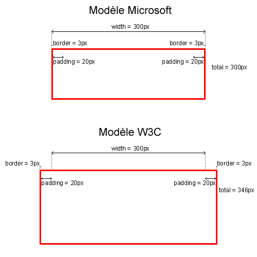

### La balise HTML

Vient ensuite la balise &lt;html&gt;. Elle encadre l'ensemble des autres balises. 

Elle contient deux balises :

- &lt;head&gt;, qui va contenir tout l'en-tête de la page et
- &lt;body&gt; qui va contenir tout le corps du document.

**Attention** : dans un document, les balises **html**, **body** et **head** doivent être uniques !

### Les commentaires

Les commentaires permettent de laisser des informations ou des descriptions du code et sont utilisables à n'importe quel endroit de votre document.

Ces commentaires ne seront pas affichés dans le navigateur mais ils resteront présents dans la page. 

Ils sont délimités par &lt;!-- et  --&gt; et peuvent être multilignes.

	<!-- Voici un premier commentaire sur une ligne. -->
	 
	<!-- Voici un deuxième commentaire.
	     Celui-ci est multilignes. -->

## HTML - Entête du document

### Titre

Le titre de la page est positionné avec la balise `<title>`.

		<title>Application</title>

### Scripts

Programmes *Javascript* ajoutés à la page pour gérer le contenu dynamiquement.

Script interne et externe.

### Script externe

Pour inclure une bibliothèque ou un script extérieur à la page :

		

### Script interne

Code javascript écrit directement dans la page.

		

*Note : la balise script peut s'utiliser partout dans la page*

### Les styles

Les feuilles de style en cascade (CSS) sont déclarées ou importées dans la balise `head`.

Il y a deux façons d'ajouter du CSS à une page : externe ou interne.

### CSS Interne

		

### CSS Externe

Utilisé pour inclure un fichier CSS de définition.

		<link rel="stylesheet" type="text/css" href="moncss.css">

### Méta

Renseigne des informations sur la page : auteur, description du document, mot-clés, encodage...

Deux types de balise méta :

- Les méta **name** : informations concernant le document.
- Les méta **http-equiv** : concernent la communication du navigateur.

### Content-type

Précise le type **MIME** de contenu ainsi que le jeu de caractères utilisé pour l'encodage du fichier.

		<meta http-equiv="content-type" content="text/html; charset=utf-8">

Autres méta `http-equiv` : *refresh*, *pragma*, *expires*, *set-cookie*

### Autres métas

		<meta name="author" content="Arnaud TOURNIER">

Ainsi que d'autres : *description*, *keywords*, *subject*, *language*.

## HTML - Corps du document

### Corps du document

C'est dans la balise `<body>` que nous allons mettre tout le texte et toutes les images qui apparaîtront lorsqu'un visiteur viendra sur notre page.

### Les niveaux de titres

Il existe différents niveaux de titres, ils vont de 1 à 6 et ont chacun leur importance. La balise représentant ces niveaux de titre est `<hX>` où `X` représente le niveau. 

Exemple :

	<h1>Titre de ma page</h1>
	<h2>Sous titre</h2>

Il est important de respecter la hiérarchie des différents niveaux de titres (pas de *h2* au dessus d'un *h1).

On choisi un niveau de titre de façon logique et non en fonction du rendu désiré (qui se fera avec le CSS).

### Les paragraphes de texte

En HTML c'est la même chose on précise où commence un paragraphe et où il se termine. C'est ce à quoi sert la balise `
`.

	
Voici un premier paragraphe.

	 
	
Voici un deuxième paragraphe.

### Retour à la ligne ?

Au sein d'un paragraphe, on utilise la balise ` ` :

		
Voici un premier paragraphe avec un   retour à la ligne !!

### La mise en forme de texte

Ici nous étudions les techniques rudimentaires de formattage du texte. CSS nous permettra de faire beaucoup mieux !

### Le texte en gras

Pour mettre le texte en gras on l'encadre de la balise `<b>` :

	<b>Ce texte s'affichera en gras.</b>

### Le texte italique

Pour mettre le texte en italique on l'encadre de la balise `<i>` :

	<i>Ce texte s'affichera en italique.</i>

### Le texte souligné

Pour souligner le texte on l'encadre de la balise `<u>` :

	<u>Ce texte sera souligné.</u>

### Le texte barré

Pour barrer le texte on l'encadre de la balise `<s>` :

	<s>Ce texte sera barré.</s>

### Le texte en exposant

Pour placer le texte en exposant on l'encadre de la balise `` :

	Ce texte sera en exposant.

### Le texte en indice

Pour placer le texte en indice on l'encadre de la balise `` :

	Ce texte sera en indice.

### Modifier la couleur du texte

Pour modifier la couleur du texte on utilise l'attribut color de la balise `` :

	Ce texte sera en rouge.

### Les couleurs

Les couleurs peuvent être écrites de deux manières :

- en hexadécimal de type RVB et précédées d'un dièse (#). Par exemple : #ff0000 => rouge, #00ff00 => vert, #0000ff => bleu.

- textuelle (en anglais). Par exemple : `red`, `yellow`, `pink`.

### Modifier la police du texte

Pour modifier la police du texte on utilise l'attribut face de la balise `` :

	Ce texte sera en verdana.

On a tendance à demander une famille de polices plutôt qu'une seule police. En effet, cela permet d'être sûr d'obtenir la plus proche si non installée.

### Polices par préférence

On sépare alors les différentes polices par une virgule dans l'ordre de sélection le cas où la précédente ne peut pas être affichée.

	Ce texte sera en verdana ou en sans-serif si verdana n'est pas installée.

### Modifier la taille du texte

Pour modifier la taille du texte on utilise l'attribut size de la balise `` :

	Ce texte sera en taille 5.

Par défaut, la valeur de l'attribut size vaut "3". 

Il y a deux manières de modifier la valeur de cet attribut : et les valeurs possibles sont les entiers de "1" à "7".

- En absolu : Les valeurs possibles sont les entiers de "1" à "7".
- En relatif : Les valeurs possibles les entiers de "-2" à "+4".

### Font, combinaison color, face et size

Et il est bien évidemment possible de renseigner ces trois attributs (color,  face, size) à la fois dans la même balise ``. 

### Les images

Pour afficher une image on utilise la balise ``.

Plus important attributs : `src` et `alt`.

- `src` renseigne le chemin de l'image, qui peut être absolu HTTP ou relatif.
- `alt` affiche un texte alternatif à la place de l'image dans le cas où elle ne peut pas être chargée. Il aide également au référencement et à l'accessibilité.

		

### Les liens hypertextes

Un lien hypertexte est un élement HTML permettant d'envoyer le visiteur vers une nouvelle page. On peut insérer dans cet élément toute sorte de textes, images et autres balises dites "inline" (comme les balises ``, `<strong>`, etc). 

Un lien sera représenté dans le code par la balise `<a>`. Tout ce qui sera dans cette balise fera office de lien. L'adresse de destination doit se trouver dans l'attribut href. 

	<a href="adresse/de/destination.html">Texte du lien</a>

	

On distingue deux types de liens, les liens externes et les liens internes.

### Les liens externes

Un lien externe est un lien hypertexte qui renvoie vers une page hébergée par un site différent de celui qui a servi la page.

### Les liens internes

Un lien interne est un lien qui renvoie vers une page appartenant au même site que celui qui a fourni la page dans laquelle se trouve le lien en question.

On utilise pour cela les *ancres*.

### Les ancres

Les ancres permettent de naviguer à l'intérieur d'une même page.

Pour faire une ancre, il faut utiliser `#` suivi d'un mot-clef. Ce mot-clef sera repris dans l'attribut `id` d'une balise à laquelle on fait faire une ancre :

	<h2 id="motClef">Texte vers lequel l'ancre est renvoyée</h2>
	
	[...]

	<a href="#motClef">Texte de mon ancre</a>

Si vous voulez faire une ancre vers une page externe :

	<a href="adresse/de/destination.html#motClef">Texte de mon ancre</a>

### Liens vers d'autres cadres

Si vous utilisez des cadres pour votre navigations, on peut les utiliser comme destination :

	<a href="adresse/de/destination.html" target="cadrePrincipal">Lien de mon menu</a>

### Nomenclature des cadres

Il existe plusieurs valeurs pour l'attribut target :

- _self : Affichage dans le cadre courant (par défaut).
- _blank : Ouvre le lien dans une nouvelle fenêtre.
- _top : Affichage dans la totalité de la fenêtre courante.
- _parent : Affichage dans le cadre qui enveloppe la structure courante.
- *NomDuCadre* : Affichage dans le cadre spécifié.

### Les liens e-mails

Vous pouvez permettre à vos visiteurs d'écrire sur votre adresse e-mail avec la syntaxe "mailto:" :

	<a href="mailto:jwillette@monsite.com">Ecrivez-moi</a>

Ce type de liens ouvre le logiciel de messagerie par défaut de vos visiteurs.

On peut aussi renseigner le sujet de l'e-mail ainsi que le corps :

	<a href="mailto:jwillette@monsite.com?subject=Sujet du mail">Ecrivez-moi</a>

	<a href="mailto:jwillette@monsite.com?subject=Sujet du mail&body=Corps du mail">Ecrivez-moi</a>

	<a href="mailto:destinataire1@monsite.com?cc=destinataire2@monsite.com">Ecrivez-nous</a>

### Les cadres

Les cadres servent à séparer la fenêtre en différents morceaux indépendants qui peuvent chacun contenir une page HTML différente, ces morceaux ayant la capacité de communiquer entre eux. 

### Débuter avec les cadres

Création d'une page avec cadres qui chargent les sous-pages. On utilise les balises `<frameset>` et `<frame>`.

	<!doctype html>
	<html>
	<head>
	    <title>Titre de la page</title>
	    <meta http-equiv="content-type" content="text/html; charset=utf-8">
	</head>
	<frameset cols="20%, *, 20%">
		<!-- Ici le contenu de la frameset principale -->
		<frame name="menu" src="menu.html"/>
    	<frame name="contenu" src="page1.html"/>
    	<frameset cols="200, *">
	        <frame name="menu" src="menu.html"/>
	        <frame name="contenu" src="page1.html"/>
	    </frameset>
	</frameset>
	</html>

Ici, `<frameset>` a remplacé `<body>`.

### Les cadres locaux

Le cadre local ou "iframe" permet également d'insérer une page externe dans notre site, à la différence qu'il sera à la suite du contenu de notre propre document et non pas séparé par un troisième fichier qui fait la jointure. 

	<iframe frameborder="0" marginwidth="0" marginheight="0" src="http://adresse/d/une/page.html">
	    Désolé, votre navigateur ne supporte pas les cadres locaux
	</iframe>

### Les listes

Elles servent, comme leur nom l'indique, à créer une liste d'items, plus précisément à les énumérer.

Différents types :

- Les listes non ordonnées, ou à puces.
- Les listes ordonnées.
- Les listes de définitions.
- Les listes de menus.

### Les listes non ordonnées

Elles sont démarquées par la balise `<ul>` et chacun des items est entouré de la balise `<li>` :

	
Ma liste de courses :

	<ul>
	    <li>Champignons</li>
	    <li>Avocat</li>
	    <li>Dentifrice</li>
	    <li>Céréales</li>
	</ul>

### Différents types de puces

L'attribut `type` de `ul` peut prendre ces valeurs :

- disc (par défaut au niveau 1 d'imbrication)
- circle (par défaut au niveau 2 d'imbrication)
- square (par défaut au niveau 3 et suivants d'imbrication)

		
Ma liste de courses :

		<ul type="circle">
		    <li>Champignons</li>
		    <li>Avocat</li>
		    <li>Dentifrice</li>
		    <li>Céréales</li>
		</ul>

### Les puces en image

On peut aussi utiliser des images externes pour dessiner les puces, avec CSS :

	
Ma liste de courses :

	<ul>
	    <li>Champignons</li>
	    <li>Avocat</li>
	    <li>Dentifrice</li>
	    <li>Céréales</li>
	</ul>

	li
	{
	    list-style-image : url(puce.gif);
	}

### Les listes ordonnées

Elles sont introduites par la balise `<ol>` et chacun des items est encadré par la balise `<li>` :

	
Top 3 du tiercé :

	<ol>
	    <li>Jolly</li>
	    <li>Tonnerre</li>
	    <li>Tornade</li>
	</ol>

### Types de numérotation

L'attribut `type` de la balise `ol` permet de définir la numérotation à utiliser :

- `1` : Numérotation par les chiffres arabes (par défaut).
- `I` : Numérotation par les chiffres romains.
- `i` : Numérotation par les chiffres romains minuscules.
- `A` : Numérotation par les lettres de l'alphabet.
- `a` : Numérotation par les lettres de l'alphabet minuscules.

		
Top 3 du tiercé :

		<ol type="I">
		    <li>Jolly</li>
		    <li>Tonnerre</li>
		    <li>Tornade</li>
		</ol>

### Modifier le début de la numérotation

Il est possible de modifier le numéro de départ par lequel va s'incrémenter la numérotation. 

	
Top 3 inversé du tiercé :

	<ol type="I" start="8">
	    <li>Tortue</li>
	    <li>Escargot</li>
	    <li>Limace</li>
	</ol>

### Les listes de définitions

Elles sont délimitées par la balise `<dl>` qui comprend une liste de termes à définir représentés par la balise `<dt>` qui peuvent avoir une ou plusieurs définitions elles-mêmes encadrées par la balise `<dd>`.

	<dl>
	    <dt>Oreiller</dt>
	    <dd>Pièce de literie bourrée de plumes destinée à soutenir la tête pendant le repos.</dd>
	    <dt>Puce</dt>
	    <dd>Insecte de très petite taille se déplaçant par sauts.</dd>
	    <dd>Marché où l'on vend des objets d'occasion.</dd>
	</dl>

### Les listes de menus

Elles sont représentées par la balise `<menu>` et chacun des items est délimité par la balise `<li>`.

	<menu>
	    <li>Accueil</li>
	    <li>Page 1</li>
	    <li>Page 2</li>
	</menu>

### Les listes imbriquées

L'imbrication des listes permet une présentation claire et détaillée d'un menu ou d'un sommaire par exemple.

	<ol type="I">
	    <li>La genèse</li>
	    <li>La vie
	        <ol type="A">
	            <li>L'enfance</li>
	            <li>L'adolescence</li>
	            <li>Le passage à l'âge adulte
	                <ul>
	                    <li>Le jeune adulte</li>
	                    <li>La crise de la quarantaine</li>
	                </ul>
	            </li>
	            <li>La vieillesse</li>
	        </ol>
	    </li>
	    <li>La mort</li>
	</ol>

### L'utilité des listes

L'utilisation des listes non ordonnées imbriquées avec un peu de CSS permet de construire des menus déroulants.

D'autre part, on peut retrouver les listes ordonnées principalement pour la rédaction de sommaires. 

### Les tableaux

Affichage de données tabulées.

**Attention** : A une époque (révolue) les tableaux étaient utilisés pour effectuer de la mise en page.

Aujourd'hui il faut préférer le CSS à cette fin !

### Les bases d'un tableau

Un tableau est délimité par la balise `<table>`. Le contenu d'un tableau HTML est généré ligne par ligne. On crée des lignes grâce aux balises `<tr>`. On y insère des cellules grâce aux balises `<td>`.

Le contenu de chaque cellule se trouve à l'intérieur des balises `<td>`. 

	<table border="1" cellspacing=0 callpadding=0 summary="Pour les non-voyants">
	    <tr>
	        <td>Cellule 1</td>
	        <td>Cellule 2</td>
	    </tr>
	    <tr>
	        <td>Cellule 3</td>
	        <td>Cellule 4</td>
	    </tr>
	</table>

### Le titre d'un tableau

Pour décrire le contenu d'un tableau il faut utiliser la balise `<caption>` :

	<table border="1">
	    <caption align="bottom">Notes de la classe de 3èmeB</caption>
	    <tr>
	        <td>Elèves</td>
	        <td>Français</td>
	    </tr>
	    <tr>
	        <td>Laure</td>
	        <td>14</td>
	    </tr>
	</table>

### La ligne d'en-tête d'un tableau

On utilise la balise `<th>` pour la ligne d'en-tête :

	<table border="1">
	    <caption align="bottom">Notes de la classe de 3èmeB</caption>
	    <tr>
	        <th>Elèves</th>
	        <th>Français</th>
	        <th>Mathématiques</th>
	    </tr>
	    <tr>
	        <td>Laure</td>
	        <td>14</td>
	        <td>11</td>
	    </tr>
	</table>

### Les différentes parties d'un tableau

On peut différencier trois grandes parties : `thead`, `tfoot` et `tbody` :

		<table border="1">
		    <caption align="bottom">Notes de la classe de 3èmeB</caption>
		 
		    <thead>
		        <tr>
		            <th>Elèves</th>
		            <th>Français</th>
		        </tr>
		    </thead>
		 
		    <tfoot>
		        <tr>
		            <th>31</th>
		            <th>11.8</th>
		        </tr>
		    </tfoot>
		 
		    <tbody>
		        <tr>
		            <td>Laure</td>
		            <td>14</td>
		        </tr>
		        ...
		    </tbody>
		</table>

### Fusion de lignes et de colonnes

La fusion peut être horizontale ou verticale. Elle s'opère sur les cellules, donc sur la balise `<td>`. On utilise les attributs `colspan` ou `rowspan`. Ces attributs prennent pour valeurs le nombre de cellules à fusionner.

	<table border="1">
	    <tr>
	        <td colspan="5">Cellule qui se répend sur 5 colonnes</td>
	    </tr>
	    <tr>
	        <td>Colonne 1</td>
	        <td>Colonne 2</td>
	        <td>Colonne 3</td>
	        <td>Colonne 4</td>
	        <td>Colonne 5</td>
	    </tr>
	</table>

### Illustration rowspan

	<table border="1">
	    <tr>
	        <td rowspan="2">Cellule sur deux lignes</td>
	        <td>Ligne 1 - Colonne 2</td>
	        <td>Ligne 1 - Colonne 3</td>
	        <td>Ligne 1 - Colonne 4</td>
	    </tr>
	    <tr>
	        <td>Ligne 2 - Colonne 2</td>
	        <td>Ligne 2 - Colonne 3</td>
	        <td>Ligne 2 - Colonne 4</td>
	    </tr>
	</table>

On peut bien sur combiner les deux techniques dans un même tableau !

### L'utilité des tableaux

Les techniques de fusion ont donné lieu à une utilisation des tableaux pour faire de la mise en page. Cette utilisation est à proscrire absolument (responsive design).

- alourdissent les pages HTML.
- difficiles à maintenir.
- nuisent à l'accessibilité.

On ne doit donc utiliser les tableaux que pour présenter de données tabulaires.

### Les formulaires

Les formulaires servent à envoyer au serveur des données saisies par l'utilisateur (login, formulaire d'inscription ...). 

Les formulaires sont dotés de divers contrôles comme des champs de saisie, des boutons, des listes, etc, qui permettent au visiteur d'interagir avec la page.

### La balise form

Tous les champs de formulaires doivent se trouver dans la balise `<form>`.

Cette balise est utile pour :

- regrouper les champs dans un formulaire
- renseigner la page de destination du formulaire (attribut `action`),
- renseigner le mode d'envoi (attribut `method` : get ou post),
- renseigner le mode d'encodage (attribut `enctype` : mar exemple `multipart/form-data`).

Squelette d'un formulaire :

		<form action="envoi-formulaire.php" method="post">
		    <!-- Contenu du formulaire -->
		    <!-- Champs du formulaire -->
		</form>

### Les champs texte monolignes

Balise : `input` avec attribut `type` à 'text' ou 'password'.

Attributs :

- name : nom du champ **valable pour tous les champs de formulaire !**,
- value : valeur par défaut du champ,
- size : taille en nombre de caractères,
- maxlength : taille max en nombre de caractères
- readonly et disabled : mettre le champ en readonly ou désactivé (la valeur d'un champ désactivé n'est pas envoyé au serveur).

### Champs texte, exemples

		<input type="text" size="5" name="code_postal" maxlength="5">
		 
		<input type="text" name="nom_champ" readonly="readonly" value="Champ vérouillé">
		 
		<input type="text" name="login" value="Entrez ici votre login" size="20">
		 
		<input type="password" name="mdp">

### Zone de texte

Pour saisir de plus longs messages, on utilise la balise `<textarea>`. C'est une balise double, son contenu (sa valeur) est contenue entre ses deux balises.

Attributs :

- rows et cols spécifient le nombre de lignes et de colonnes.
- name, readonly et disabled.

### TextArea, exemple

		<textarea name="commentaire" rows="5" cols="80"></textarea>
		 
		<textarea name="sujet" rows="6" cols="100">Texte par défaut</textarea>

### Les champs cachés

Lorsque l'on souhaite envoyer au serveur une donnée qu'on ne veut pas montrer à l'utilisateur. **Attention** : n'apporte aucune sécurité car la valeur du champ peut être aisément trouvée avec les outils de dév du navigateur.

		<input type="hidden" name="clef" value="a182f7d8e844d956a65b18e84f"/>

### Les champs de fichiers

Pour permettre aux visiteurs d'envoyer des fichiers on va utiliser la balise `<input>` dont l'attribut **type** est renseigné à **file**.

Avec ce type champ, la balise `<form>` doit prendre l'attribut **enctype** à **multipart/form-data**.

		<input type="file" name="image"/>

### Les boutons radio

Les boutons radio sont utilisés pour proposer un choix à l'utilisateur. La balise est alors `<input>` dont l'attribut type est renseigné à "radio".

Fonctionne par groupe (même attribut **name** pour les champs du même groupe).

La valeur transmise sera celle de l'attribut **value** de la case cochée.

Pour forcer l'état du radio on utilise l'attribut "checked". 

### Radio boutons, exemple

	    <input type="radio" name="civilité" value="mlle"> Mademoiselle
	    <input type="radio" name="civilité" value="mme"> Madame
	    <input type="radio" name="civilité" value="mr"> Monsieur
 
	    <input type="radio" name="genre" value="homme" checked="checked"> Homme
	    <input type="radio" name="genre" value="femme"> Femme
	    <input type="radio" name="genre" value="et"> Alien
	    <input type="radio" name="genre" value="indéfini"> Indéfini

### Les cases à cocher

Semblable aux boutons radio, mais avec la possibilité de choisir plusieurs cases.

L'attribut **type** de l'élément **input** est placé à *checkbox*.

**Attention** il faut préciser le nom avec le suffixe `[]` pour indiquer au serveur qu'il s'agit d'un tableau de valeurs.

		<input type="checkbox" name="qualite[]" value="intelligent"> Intelligent
		<input type="checkbox" name="qualite[]" value="beau"> Beau
		<input type="checkbox" name="qualite[]" value="serviable"> Serviable
		<input type="checkbox" name="qualite[]" value="fort"> Fort
		<input type="checkbox" name="qualite[]" value="généreux"> Généreux

### Les listes

<select name="couleur_yeux">
    <option value="bleus">Bleus</option>
    <option value="bruns" selected="selected">Bruns</option>
    <option value="verts">Verts</option>
    <option value="noisettes">Noisettes</option>
    <option value="gris">Gris</option>
    <option value="vairons">Vairons</option>
</select>

Les listes permettent de laisser un choix aux visiteurs.

On utilise la balise `<select>` qui comprend les différents choix sous forme de balise `<option>` (avec `value` positionné).

L'option par défaut est précisé avec l'attribut `selected`.

		<select name="couleur_yeux">
		    <option value="bleus">Bleus</option>
		    <option value="bruns" selected="selected">Bruns</option>
		    <option value="verts">Verts</option>
		    <option value="noisettes">Noisettes</option>
		    <option value="gris">Gris</option>
		    <option value="vairons">Vairons</option>
		</select>

### Liste à choix multiples

<select name="matieres_preferees" multiple="multiple">
    <option value="maths">Maths</option>
    <option value="anglais">Anglais</option>
    <option value="histoire">Histoire</option>
    <option value="physique">Physique</option>
    <option value="sciences naturelles">Sciences naturelles</option>
</select>

On rajoute l'attribut `multiple` à la valeur `multiple`. La valeur de l'attribut `size` doit aussi être renseigné.

		<select name="matieres_preferees" size="5" multiple="multiple">
		    <option value="maths">Maths</option>
		    <option value="anglais">Anglais</option>
		    <option value="histoire">Histoire</option>
		    <option value="physique">Physique</option>
		    <option value="sciences naturelles">Sciences naturelles</option>
		</select>

### Les boutons

Deux balises sont possibles : `<button>` et `<input>`. `<button>` est double. La balise `<button>` permet de faire plus de mise en forme.

Le bouton peut être utilisé au sein d'un formulaire ou pas (avec Javascript dans ce cas).

### Le bouton d'envoi de formulaire

<form action=""><input type="submit" name="envoyer" value="Valider"></form>

<button>Soumettre les réponses...</button>

Déclenche l'envoi du formulaire dans lequel il est contenu. On utilise la balise `<input>` avec l'attribut `type` à `submit` :

		<input type="submit" name="envoyer" value="Valider">
		 
		<button type="submit" name="soumettre">Soumettre les réponses</button>

### Le bouton effacer

Permet de réinitialiser un formulaire.

		<input type="reset" name="effacer" value="Effacer toutes les valeurs">
		 
		<button type="reset" name="effacer">Réinitialiser</button>

### Le bouton simple

Utilisé avec du Javascript pour spécifier un comportement...

		<button onclick="alert('Coucou !');">
			<b>Multiplier</b>
		</button>

### Accessibilité des formulaires

La balise `<fieldset>` permet de grouper logiquement des champs de formulaires de même nature.

		<form>
			<fieldset>
			    <legend>Informations personnelles</legend>
			 
			    <!-- Ici divers champs sur les informations personnelles, comme la saisie du nom, prénom et adresse -->
			</fieldset>
		</form>

### Accessibilité des formulaires

Il y a d'autre part, la balise `<label>` qui permet de donner un libellé à un champ de formulaire en les associant à l'aide de l'attribut for de cette balise qui doit être identique à l'attribut id du champ auquel elle est rattachée. Le texte mis dans le label est alors cliquable.

<label for="nom">Votre nom</label> <input type="text" name="nom" id="nom">
Aimez-vous la viande ?
<label for="oui">Oui</label> <input type="radio" name="viande" id="oui">
<label for="non">Non</label> <input type="radio" name="viande" id="non">

		<label for="nom">Votre nom</label> <input type="text" name="nom" id="nom">
		 
		Aimez-vous la viande ?
		<label for="oui">Oui</label> <input type="radio" name="viande" id="oui">
		<label for="non">Non</label> <input type="radio" name="viande" id="non">

### La DIVision

Elément neutre, division du document. Affiché par défaut en mode `block`.

Il permet d'organiser le contenu mais ne représente rien en particulier.

A ne pas utiliser si un élément sémantique convient mieux (`nav`, `article`, `header`, `footer`, `section`).

### Span

Conteneur générique de ligne pour les contenus phrasés. Il ne représente rien par lui-même.

Utilisé pour grouper des éléments afin de les styliser.

A la différence de `
` qui est un élément `block`, `` est un élement de ligne (`inline`).

		Un morceau de texte

## CSS

### Introduction

Langage pour spécifier la façon dont sont présentés les documents html.

CSS est utilisé pour définir des styles, le design, le layout et les variations d'affichage selon la résolution.

Le document HTML spécifie la structure, le CSS l'affichage.

### Premier essai

HTML avec son CSS inclus :

<html>
	<head>
		
	</head>
	<body>
		
Cascading Style Sheets

	</body>
</html>

Donne :

Cascading Style Sheets

### Autre possibilité

On peut définir le style directement dans l'attribut `style` de la balise cible.

		
Cascading Style Sheets

donne :

Cascading Style Sheets

### La cascade

Le style final appliqué a un élément peut être spécifié à partir de différents endroits. Les intéractions peuvent donc être complexes, ce qui rend CSS à la fois puissant et difficile à débugguer.

Sources d'information en cascade :

- comportement par défaut du navigateur,
- fichiers CSS externes,
- CSS interne à la page,
- attribut 'style' de l'élément.

### Exemple

Dans l'exemple suivant :

		<strong style='color:red;'>Je</strong> suis strong

Le mot "<strong style='color:red;'>Je</strong>" est :

- gras car c'est la définition du navigateur pour `strong`,
- l'élément `strong` hérite aussi de `p` et de `body`,
- rouge car le style est spécifié dans l'attribut.

### Héritage, exemple

Maintenant créons une feuille externe avec :

		p { 
			color: blue;
			text-decoration: underline;
		}

		strong {
			color: red;
		}

### Héritage, exemple

Et le contenu html suivant :

		

		  <strong>C</strong>ascading
		  <strong>S</strong>tyle
		  <strong>S</strong>heets
		

Voyez comment l'héritage est appliqué.

### Sélecteurs

Le texte suivant :

		strong {
			color: red;
		}

est appelé une **règle** CSS. *strong* est le **sélecteur**, il sélectionne les éléments sur lesquels s'appliquent la règle.

### Sélecteur par type

Sélectionne tous les éléments du type spécifié :

		a { color: red; }
		ul { margin-left: 0; }

### Sélecteur par classe

L'attribut `class` dans un élément permet de lui assigner une ou plusieurs *classes* nommées. Les classes peuvent être référencées par plusieurs éléments.

		
Un paragraphe

Dans le fichier CSS on a :

		.rouge { ... }
		.avertissement { font-weight: bolder; }

### Sélecteur par ID

L'attribut `id` d'un noeud peut aussi être mis à profit dans une feuille de style :

		.urgent { font-size: bold; color: red; }
		#principal { color: green; }

Sera appliqué sur l'élément *principal* :

		

La règle la plus spécifique prendra le dessus sur les autres.

### Les pseudo-sélecteurs

Suffixe ajouté à un sélecteur pour spécifier filtrer l'application des règles en fonction de l'état des noeuds.

Par exemple le sélecteur `:hover` permet d'appliquer un style lorsque la souris survole l'élément :

		.urgent:hover { font-size: 300%; }

Passez la souris...

### Liste de pseudo-sélecteurs

Liste complète ici : [w3.org/TR/selectors](http://www.w3.org/TR/selectors/#selectors).

Exemples : *link*, *visited*, *active*, *hover*, *focus*, *first-child*, *last-child*, *nth-child*, *nth-last-child*, *first-of-type*, *last-of-type*, *empty*, *target*, *checked*, *enabled*, *disabled*.

### Le sélecteur *

Sélectionne tous les éléments.

		* {
			margin: 0;
			padding: 0;
		}

		#container * {
			border: 1px solid black;
		}

### Sélecteurs de relation

Il est possible de combiner les sélecteurs (ici A et E sont des sélecteur que l'on combine) :

Sélecteur    |   Sélectionne les élements satisfaisant...
----------------|-----------------
A, E         | A **ou** E
AE           | A **et** E
A E           | E et descendant d'un élément satisfaisant A
A > E         | E et fils **direct** d'un élément satisfaisant A
E:first-child  |  E et qui sont dans l'état décrit par le pseudo-sélecteur
B + E        |  E et qui suivent un élément satisfaisant B (avec le même parent)

### Relation, exemple

		

### Relation, exemple

Voici un code :

		

	    <table id="data-table-1">
			<tr>
				<td>Prefix</td>
				<td>0001</td>
				<td>default</td>
			</tr>
		</table>

### Relation, exemple

Et son rendu :

<table id="data-table-1">
<tr>
<td>Prefix</td>
<td>0001</td>
<td>default</td>
</tr>
</table>

### Autres sélecteurs

		a[title] {
			color: green;
		}

		/* valeur exacte */
		a[href="http://net.tutsplus.com"] {
			color: #1f6053;
		}

		/* valeur contenue */
		a[href*="tuts"] {
			color: #1f6053;
		}

### Autres sélecteurs

		/* commence par */
		a[href^="http"] {
			background: url(path/to/external/icon.png) no-repeat;
			padding-left: 10px;
		}

		/* finit par */
		a[href$=".jpg"],
		a[href$=".jpeg"] {
			color: red;
		}

### Autres sélecteurs

		input[type=radio]:checked {
			border: 1px solid black;
		}

		div:not(#container) {
			color: blue;
		}

### Autres sélecteurs

		p::first-line {
			font-weight: bold;
			font-size: 1.2em;
		}

		p::first-letter {
			float: left;
			font-size: 2em;
			font-weight: bold;
			font-family: cursive;
			padding-right: 2px;
		}

		li:nth-child(3) {
			color: red;
		}

### Autres sélecteurs

		/* Eléments impairs */
		ul:nth-child(odd) {
			border: 1px solid black;
		}

		/* Eléments pairs */
		ul:nth-child(even) {
			border: 1px solid pink;
		}

### Exemple : personnaliser une liste

		<ul>
		   <li> List Item </li>
		   <li> List Item </li>
		   <li> List Item </li>
		</ul>

Donne normalement :

<ul>
   <li> List Item </li>
   <li> List Item </li>
   <li> List Item </li>
</ul>

### Exemple : personnaliser une liste

		ul {
			width: 200px;
			background: #292929;
			color: white;
			list-style: none;
			padding-left: 0;
		}
		 
		li {
			padding: 10px;
			border-bottom: 1px solid black;
			border-top: 1px solid #3c3c3c;
		}

### Liste personnalisée

Résultat :

<ul class='lp'>
   <li>Item 1</li>
   <li>Deuxième item</li>
   <li>Dernier élément</li>
</ul>

### Mettre ses CSS au propre !

Ne pas oublier l'indentation,

Utiliser les commentaires (`/* ... */`),

Grouper les sélecteurs (`h1, h2, h3 { color: navy; }`)

### Styles pour le texte

C'est le style `font`.

		p {font: italic 75%/125% "Comic Sans MS", cursive;}

Police : il est bon d'au moins demander la famille de police (serif, sans-serif, cursive, fantasy, monospace).

Changer seulement la police est accessible avec le style `font-family`.

### Styles pour le texte

Le style `font-size` permet de spécifier la taille du texte. Soit en absolu (`14pt`, `16px`) ou relatif (`smaller`, `larger`, `150%`, `1.5em`).

La hauteur de ligne est spécifiable avec `line-height`.

Il est possible de décorer le texte avec `text-decoration` qui peut être `underline` ou `line-through`...

		.autresStyle {
			font-style: italic;
			font-weight: bold;
			font-variant: small-caps;
		}

### Couleurs

Couleur de premier plan : `color`.

Couleur d'arrière plan : `background-color`.

		.test {
			color: rgb(160,5,4);
			background-color: green;
		}

Et voilà !

### Ajout de contenu

CSS permet l'ajout de contenu avant ou après un élément sélectionné.

		Voici une référence

		.ref::before {
			content: "Ajout par CSS: ";
			font-weight: bold;
		}

Il est même possible de rajouter une image !

		a.glossaire:after {
			content: " " url("images/glossaire.png");
		}

### Utilisation d'une url

Il est possible de spécifier des url dans certains styles CSS. Par exemple le style `background` l'autorise :

		background: url("lune-rousse.png");

### Personnaliser une liste

On utilise la propriété `list-style` pour spécifier le type de marqueur souhaité.

La propriété peut être appliquée aux différents `<li>` ou bien au `<ul>` qui le transmettra par héritage.

Pour une liste **ul**, la propriété peut valoir `circle`, `disc` ou `square`.

Pour une liste **ol**, la propriété peut valoir `decimal`, `lower-roman`, `upper-roman`, `lower-latin` ou `upper-latin`.

### Les puces en image

On peut aussi utiliser des images externes pour dessiner les puces, avec CSS :

	
Ma liste de courses :

	<ul>
	    <li>Champignons</li>
	    <li>Avocat</li>
	    <li>Dentifrice</li>
	    <li>Céréales</li>
	</ul>

	li
	{
	    list-style-image : url(puce.gif);
	}

### Tables

Les cellules n'ont pas de marge.

Elles ont une bordure et un padding. Par défaut les bordures sont séparées par `border-spacing` (sur la table).

L'espace entre bordures peut être retiré avec `border-collapse` à `collapse`.

### Tables - caption

La légende peut être positionnée avec la propriété `caption-side` (`top` ou `bottom`).

		#demo-table > caption {
			caption-side: bottom;
			font-style: italic;
			text-align: right;
		}

### Tables - exercice

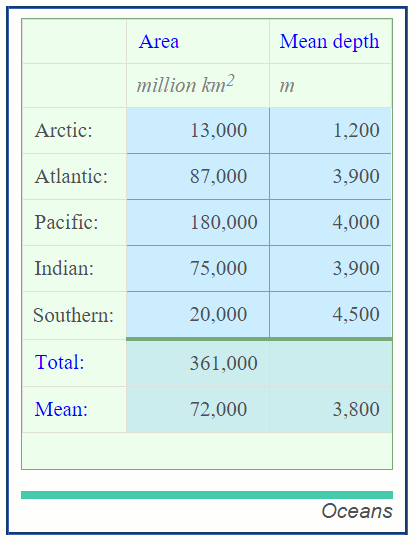

La liste complète des propriétés CSS destinées aux tables est disponible [ici](http://www.w3.org/TR/CSS21/propidx.html).

### Modèle de boîte

Lorsque le navigateur affiche un élément, l'espace occupé est découpé en quatre parties : l'*élément*, son *padding*, sa *bordure* et sa *marge*.

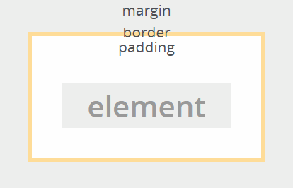

### Modèle de boîte

La marge et le padding peuvent être précisé par côté (top, left, bottom, right).

La zone padding est de même couleur que le `background` de l'élément.

La zone margin est toujours transparente.

### Modèle de boîte

La propriété `box-sizing` permet de modifier la façon dont sont calculées la largeur et la hauteur d'une boîte.

Elle peut prendre deux valeurs :

- **content-box** : largeur et hauteur sont mesurées en incluant le contenu mais pas la marge, ni le bord, ni le padding.
- **border-box** : largeur et hauteur incluent le padding et la bordure, mais pas la marge.

### La bordure

La propriété est `border`. On spécifie la **largeur**, le **style** et la **couleur** de la bordure :

		h3 {
			border: 6px dashed black;
			border-top: 4px solid #7c7;
		}

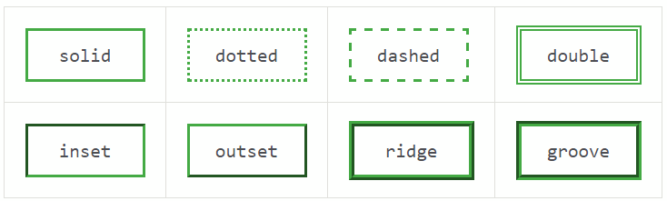

### Marge et padding

Voici un exemple :

		p.remark {
			border: 2px solid red;
			padding: 4px;
			padding-left: 44px;
			margin-left: 24px;
		}

Je suis une remarque !

### Positionnement des éléments

Le navigateur dispose les éléments dans la page en fonction plusieurs règles, 
en suivant un _"flux"_.

Deux critères sont principalement utilisés:

- la propriété `display`,
- la propriété `position`.

### La propriété `display`

Peut prendre les valeurs `block`, `inline`, `none` (et bien d'autres).

Chaque élément HTML possède sa propre valeur intrinsèque, modifiable avec CSS.

- Une `div` est par défaut en `display: block;`
- Un `span` est par défaut en `display: inline;`

### `display: block;`

Un élément `block` :

- passe à la ligne,
- utilise toute la largeur disponible,
- permet l'attribution de marges verticales,
- permet la modification de sa largeur et hauteur.

### `display: inline;`

Un élément `inline` :

- a une taille dépendant de son contenu,
- n'a pas de retour chariot ni avant, ni après (sauf si précédé par un élément `block`),
- est enchaîné directement avec les `inline` suivants.

### La propriété `position`

Altère le positionnement d'un élément en suivant (ou pas) le flux standard.

### `position: static;`

C'est la **valeur par défaut**, l'élément suit le flux normal du positionnement.

### `position: relative;`

L'élément est décalé de sa position normale tout en restant dans le flux.

Les autres éléments ne sont pas impactés.

On peut utiliser les propriétés `top`, `right`, `bottom`, `left` pour spécifier le décalage voulu.

*Positionne* l'élément, il devient un référentiel pour les descendants positionnés en `absolute`.

### `position: absolute;`

L'élément sort complètement du flux standard.

Son positionnement devient relatif à son premier parent positionné (avec position à *absolute* ou *relative*).

On peut utiliser les propriétés `top`, `right`, `bottom`, `left`, `width` et `height` pour spécifier sa position et sa taille. 

*Positionne* l'élément, il devient un référentiel pour les descendants positionnés en `absolute`.

### `position: fixed;`

La position de l'élément est relative à la **fenêtre** du navigateur (et non au body).

On peut utiliser les propriétés `top`, `right`, `bottom`, `left`, `width` et `height` pour spécifier sa position et sa taille. 

### Overflow

Définit le comportement à adopter dans le cas où un contenu est plus grand que son contenant. Les valeurs possibles sont :

- `visible`: mode par **défaut**. La partie dépassant n'est pas rognée et sera affiché en dehors du contenant.
- `hidden`: le contenu et rogné, aucun barre de défilement.
- `scroll` : les barres de défilement sont toujours affichées.
- `auto` : affiche les barres de défilement seulement si le contenu dépasse.

*Note* : crée un contexte de formattage, en relation avec les balises flottantes, démonstration...

### Float

Permet de créer un "habillage".

- L'élément est d'abord placé normalement dans le flux. Donc si un autre élément bloc est placé avant lui, l'élément flottant se positionnera en dessous; et si un élément bloc le suit, ce dernier sera placé dessous.
- L'élément `float` est _poussé_ à gauche ou à droite de son conteneur.
- Les éléments qui le suivent au sein du conteneur se placent autour de lui.

### Clear

On utilise la propriété `clear` (`left`, `right`, `both`) pour annuler l'effet d'un `float`.

`clear` demande à un élément de se placer en dessous des flottants le précédant. Appliquable autant à des flottants qu'à des non-flottants.

		
		
Un paragraphe de texte bla bla bla...

		
Un autre paragraphe après

### Empêcher les flottants de dépasser

Lorsqu'un conteneur ne contient que des flottants, sa hauteur est virtuellement '0'. Première façon d'éviter cela avec la propriété `overflow` qui crée un nouveau contexte de formattage.

		

		  
AAA

		  
BBB

		  
CCC

		

		#conteneur > .colonne {
		  width: 33%;
		  float: left;
		}

		#conteneur {
		  overflow: hidden;
		}

### La propriété `clear`

		

		  
…

		  
…

		  
…

		  

		

		#conteneur > .clear {
		  clear: both;
		  height: 0; overflow: hidden; /* Précaution pour IE 7 */
		}

### Le clear-fix

Au lieu de rajouter manuellement un élément vide avec `clear: both;`, on utilise le pseudo-élément `::after`.

		

		  
AAA

		  
BBB

		  
CCC

		

		#conteneur::after {
		  content: "";
		  display: table;
		  clear: both;
		}

### Règles pour le positionnement

- essayer de garder les éléments dans le flux tant que possible,
- modifier le mode de rendu avec la propriété `display`,
- placer des blocs côte à côte se fait avec `float` (attention au dépassement des flottants),
- pour le centrage des éléments :
-- `text-align` pour centrer un texte horizontalement,
-- `display: table-cell` et `vertical-align:middle`,
- positionnement absolu,
- positionnement relatif,
- positionnement fixe.

Voir l'**excellent** article [Guide de survie du positionnement CSS](http://www.alsacreations.com/article/lire/53-guide-de-survie-du-positionnement-css.html)

### Centrer horizontalement

Pour centrer un bloc horizontalement, on utilise la technique des *margin auto*.

Un bloc ayant la propriété `width` fixée peut recevoir `auto` comme valeur de marge :

		div#page {
		    width: 500px;
		    margin: 0 auto;
		}

### Centrer verticalement

On met à profit le mode de placement spécifique des tables.

		<table id="page-table"><tr><td id="page-td">
		    

		        <!-- Ici le contenu de la page -->
		    
<!-- #global -->
		</td></tr></table>

### Centrer verticalement

		#page-table {
		    height: 100%;
		    width: 100%;
		}

		#page-td {
		    height: 100%;
		    padding: 0;
		    vertical-align: middle;
		}

		#contenu {
		    width: 500px;
		    margin: 20px auto;
		}

### Centrer verticalement

Note : il est possible d'effectuer la même chose avec des `divs` (sans table). Pour cela on modifie le type d'affichage avec la propriété `display` :

		.container {
			display: table;
			width: 100%;
			height: 100%;
		}

		.container-row {
			display: table-row;
		}

		.container-cell {
			display: table-cell;
			vertical-align: middle;
			height: 100%;
		}

### Centrer verticalement

Le markup associé devient donc :

		

		  

		    

		      

		        Je suis le contenu
		      

		    

		  

		

### Organisation du texte

Deux propriétés sont disponibles pour spécifier l'alignment d'un contenu de type texte :

- `text-align` peut prendre les valeurs `left`, `right`, `center`et `justify` et aligne le contenu.
- `text-indent` indente le contenu.

### Multi colonne

Dans une div, on peut demander l'affichage en multi-colonne :

		div.colonnes {
			column-count: 3;
			column-width: 30px;
			column-gap: 3px;
			column-rule-width: 5px;
			column-rule-style: dashed; /* voir border */
			column-rule-color: pink;
		}

### Flexbox

Il existe un modèle de placement nouveau appelé `flexbox` qui résout beaucoup des problèmes classiques.

Flexbox se base sur le fait que le parent adapte la taille de ses enfants pour remplir au mieux l'espace disponible.

L'agencement est indépendant de la direction du flux.

### Flexbox, utilisation

On définit un conteneur flex en plaçant la propriété `display` à la valeur `flex` ou `inline-flex`. Ses enfants deviennent des *élément (item) flex*.

		.container {
		  display: flex; /* ou inline-flex */
		}

### Flexbox, flex-direction

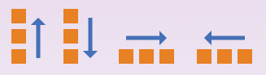

La propriété `flex-direction` spécifie la direction du flux. Elle peut être **`row`** (gauche à droite), `row-reverse` (droite à gauche`), `column` (de haut en bas) et `column-reverse` (`bas en haut`).

Elle définit donc l'**axe principal** du conteneur flex.

### Flexbox, flex-wrap

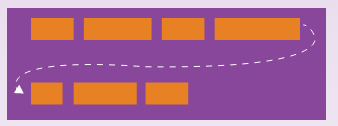

Par défaut, un conteneur flexbox essaie de placer tous se enfants sur une seule ligne. Il est possible de changer ce comportement avec la propriété `flex-wrap`.

Valeurs : **`nowrap`**, `wrap`, `wrap-reverse`.

### Flexbox, flex-flow

Les propriétés `flex-direction` et `flex-wrap` sont rassemblées dans `flex-flow` :

		.container {
			flex-flow: row wrap;
		}

### Flexbox, justify-content

Définit la répartition de l'espace restant sur l'axe principal. 

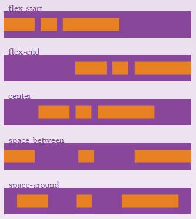

Valeurs possibles : **`flex-start`**, `flex-end`, `center`, `space-between`, `space-around`.

### Flexbox, align-items

Définit la façon dont sont répartis les `items` le long de l'axe secondaire.

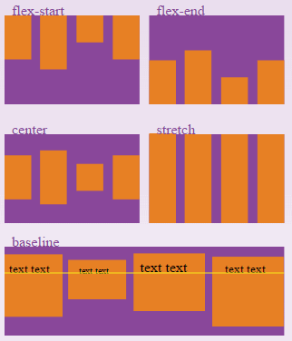

Valeurs possibles : `flex-start`, `flex-end`, `center`, **`stretch`**, `baseline`.

### Flexbox, align-content

Aligne les lignes quand il reste de l'espace sur l'axe secondaire. Aucun effet lorsqu'il n'y a qu'une ligne.

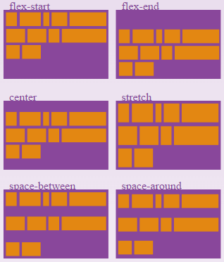

Valeurs possibles : `flex-start`, `flex-end`, `center`, **`stretch`**, `space-between`, `space-around`.

### Flexbox, propriétés des enfants

Avec flexbox, on positionne certaines propriétés sur les enfants, de façon à ajuster la façon dont fonctionne le placement.

Ces propriétés sont à placer sur les enfants directs d'un conteneur flexbox (appelés `flex items`).

### Flexbox, order

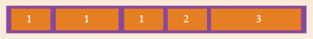

Par défaut les enfants sont positionnés dans l'ordre d'apparition dans le fichier html. La propriété `order` permet de modifier ce comportement.

		.item {
			order: 2;
		}

### Flexbox, flex-grow

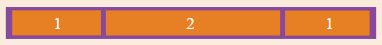

Définit si un élément peut grossir si nécessaire. La valeur donnée est une proportion (par rapport aux autres éléments). La valeur par défaut est **0**.

### Flexbox, flex-shrink

De la même manière il est possible de définir la capacité d'un enfant à réduire sa taille. Valeur par défaut : 1.

### Flexbox, flex-basis

Définit la taille de l'élément avant que n'ait lieu la répartition de l'espace disponible. Peut être une longueur (`20%`, `5em`) ou le mot-clé `auto`.

Le mot clé `auto` indique à flexbox qu'il faut utiliser les valeurs des propriétés `width` et `height` de l'élément.

### Flexbox, flex

La propriété `flex` regroupe les propriétés `flex-grow`, `flex-shrink` et `flex-basis`.

		.item {
			flex: 1 0 auto;
		}

### Flexbox, align-self

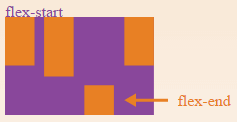

Permet de modifier l'alignement d'un élément en particulier au sein d'un conteneur flexbox.

### Flexbox, pour résumer

Sur le noeud container :

		.container {
		    display: flex;
		    flex: column wrap;
		    justify-content: space-between;
		    align-items: baseline;
		    align-content: center;
		}

Sur des éléments :

		.item {
			order: 1;
			flex: 1 0 auto;
			align-self: flex-end;
		}

### Flexbox, centrer un élément

Aussi simple que cela !

	.parent {
	  display: flex;
	}

	.child {
	  margin: auto;
	}

*(horizontalement ET verticalement bien sûr !)*

### Flexbox, autres exemples

### Media

CSS permet de modifier l'affichage en fonction du média de rendu.

Par exemple il est possible de définir un ensemble de règles ne s'appliquant que pour un certain média :

		@media print {
			#nav-area {display: none;}
		}

Voici quelques médias : `screen`, `print`, `projection`, `all`.

### Impression

Pour les médias *paginés*, on peut spécifier les marges.

		@page { margin: 2.5cm; }

On peut faire des sauts de page :

		h1 { page-break-before: always; }

### Media queries

Il est possible de changer de définition CSS en fonction de la taille de l'écran, grâce aux `media queries`.

		

### Importation

Il est possible d'importer une feuille CSS externe :

		@import url;
		@import url list-of-media-queries;

		@import url("fineprint.css") print;

A noter : l'instruction d'import permet de conditionner l'import par une `media query`.

## Responsive design

### Principe

On met à profit les media queries en fonction de la taille de l'écran.

On crée une structure HTML valable dans tous les modes.

On définit un CSS pour chaque mode.

Mais attention ! ...

### Le viewport

Ne pas oublier de rajouter ceci :

		<meta name="viewport" content="width=device-width, initial-scale=1">

### Viewport

Différentes façons de mesurer la définition de l'écran :

- la taille physique,
- la taille en Pixel CSS (taille logique fournie par le constructeur). Calculé par rapport à un pixel de référence vu d'une certaine distance. Correspond à `device-width` et `device-height`,
- la taille du viewport !

### Exemple

Taille    |  iPhone 5      |  Galaxy SIII
----------|----------------|--------------
Physique  | 640x1136       | 720x1280
CSS       | 320x           | 360x
Viewport  | 980x (Safari)  | 980x (Android 4)

Pour tous les connaître : [screensiz.es](http://screensiz.es)

### Viewport, le navigateur adapte

Afin d'afficher correctement les pages destinées aux *desktop*, les navigateurs mobiles font croire que la largeur de l'écran est de 980px (selon les navigateurs).

### Viewport, zoom initial

Au démarrage d'une page (sans méta), le navigateur utilise un zoom permettant d'afficher l'ensemble de la page

`device-width` / `viewport`

Mais pour un site conçu pour le mobile, cela est génant.

La balise meta permet donc de basculer sur la résolution réelle...

### Viewport, illustration

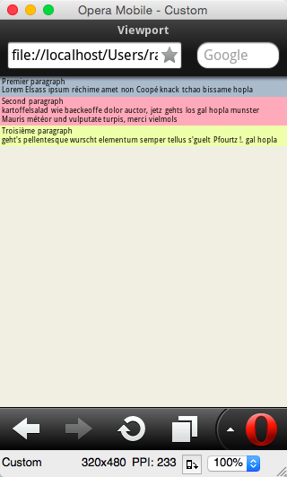
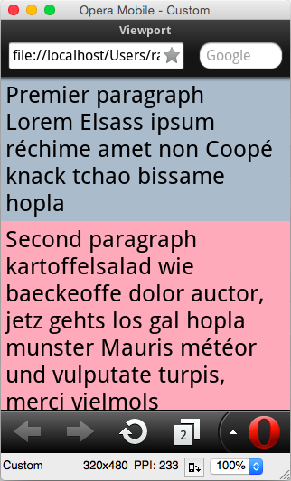

## Nouveaux éléments HTML5

### Eléments de structure

Element   |   Role
----------|--------------
`header`  |  entête de la page (sommaire, logo, menu)
`footer`  |  pieds de page (auteur, liens, copyright...)
`nav`     |  zone de navigation
`section` |  regroupement thématique
`article` |  contenu autonome
`aside`   |  afficher un contenu associé
`main`    |  contenu principal de la page

### Nouveaux elements

Element   |   Role
----------|--------------
`time`    | contenu lié au temps
`mark`    | mise en évidence
`meter`   | indication d'une mesure (*value, min, low, max, ...*)
`detail`, `summary`  | affichage master/detail
`progress`  | barre de progression
`figure`, `figcaption`  |  une figure et sa légende

## Nouveautés CSS3

### Coins arrondis

Donner des bords arrondis à un élément :

		border-radius: 10px;
		border-radius: 1em/5em;
		border-top-left-radius:     4px;
		border-top-right-radius:    3px 4px;
		border-bottom-right-radius: 6px 2px;
		border-bottom-left-radius:  3px 4px;

Attention aux préfixes !

### Dégradés

On utilise dans la propriété `background` l'attribut `-linear-gradient`, `-radial-gradient` et `gradient` selon le navigateur.

### Ombres portées

Propriété `box-shadow`. Ses attributs sont dans l'ordre :

- distance horizontale,
- distance verticale,
- taille du flou,
- taille de l'étendue (positif ou négatif),
- couleur de l'ombre portée,
- position (`inset` ou `outset`).

On peut postionner plusieurs ombres, à séparer par des virgules.

Voir le site de génération [ici](css3gen.com/box-shadow).

### Générateurs

[css3generator.com](http://www.css3generator.com/)

[colorzilla.com/gradient-editor](http://www.colorzilla.com/gradient-editor/)

[css3gen.com/box-shadow](http://css3gen.com/box-shadow)

[css3.me/](http://css3.me/)

## Transformations

### Transformations

Permet de modifier les coordonnées de formatage visuel. On peut faire subir à n'importe quel élément une *translation*, *rotation*, *homotéthie* ou encore *inclinaison*.

Normal

Rotation !

Exemples :

		transform: translate(12px, 50%)
		transform: translateX(2em)
		transform: rotate(0.5turn)
		transform: matrix(1.0, 2.0, 3.0, 4.0, 5.0, 6.0)
		transform: matrix3d(1.0, 2.0, 3.0, 4.0, 5.0, 6.0, 7.0, 8.0, 9.0, 10.0, 11.0, 12.0, 13.0, 14.0, 15.0, 16.0)
		transform: translate3d(12px, 50%, 3em)
		transform: perspective(17px)
		transform: translateX(10px) rotate(10deg) translateY(5px)

## Transitions

### Transitions

La propriété `transition` permet de positionner :

- `transition-delay`, 0s par défaut,
- `transition-duration`, 0s par défaut,
- `transition-property`, *all* par défaut,
- `transition-timing-function`, *ease* par défaut.

On peut combiner les transitions avec `,`.

Documentation [ici](https://developer.mozilla.org/en-US/docs/Web/CSS/CSS_Transitions/Using_CSS_transitions)

### Transitions, exemple

Ma police change !

		#delay1 {
		  position: relative;
		  transition-property: font-size;
		  transition-duration: 4s;
		  transition-delay: 2s;
		  font-size: 14px;
		}

		#delay1:hover {
		  transition-property: font-size;
		  transition-duration: 4s;
		  transition-delay: 2s;
		  font-size: 36px;
		}

## Animations

### Animations, exemple

Je ne suis pas animé !

		.anime {
			animation-duration: 3s;
			animation-name: slidein;
		}

		@keyframes slidein {
			from { margin-left: 100%; }

			50% {
				font-size: 200%;
				transform: rotateX(90deg);
			}

			to {
				margin-left: 0%;
				transform: rotateX(720deg);
			}
		}

## Canvas

### Canvas, introduction

`<canvas>` est un élément HTML qui peut être utilisé pour dessiner des éléments graphiques à l'aide de scripts (habituellement JavaScript). Il permet par exemple de dessiner des graphiques, de réaliser des compositions de photographies ou des animations simples.

### Canvas, exemple

<canvas id="canevas" width="150" height="150"></canvas>

		<canvas id="canevas" width="150" height="150"></canvas>

		var canvas = document.getElementById('canevas');
		var ctx = canvas.getContext('2d');

		ctx.fillStyle = "rgb(200,0,0)";
		ctx.fillRect (10, 10, 55, 50);

		ctx.fillStyle = "rgba(0, 0, 200, 0.5)";
		ctx.fillRect (30, 30, 55, 50);

Documentation [ici](https://developer.mozilla.org/fr/docs/Tutoriel_canvas/Utilisation_de_base)

## SVG

### SVG, introduction

SVG est un langage de balisage permettant de décrire des images vectorielles.

<svg version="1.1" baseProfile="full" xmlns="http://www.w3.org/2000/svg">
<rect width="100%" height="100%" fill="red"/>
<circle cx="150" cy="70" r="60" fill="green"/>
<text x="150" y="95" font-size="60" text-anchor="middle" fill="white">SVG</text>
</svg>

		<svg version="1.1" baseProfile="full" xmlns="http://www.w3.org/2000/svg">
			<rect width="100%" height="100%" fill="red"/>
			<circle cx="150" cy="70" r="60" fill="green"/>
			<text x="150" y="95" font-size="60" text-anchor="middle" fill="white">SVG</text>
		</svg>

## Javascript

### Javascript, définition

		var f = function() {
			alert('bonjour à tous !');
		}

		f();

### getElementById

### addEventListener

### JQuery

		

puis

		$('ul>li>a').click(function () {
			$(this).slideUp();
		});

### JSON

Un sous-ensemble de JavaScript permettant de décrire des données.

Exemple :

		[
			{ "id": 233, "nom": "Toto" },
			{ "id": 1045, "nom": "Titi" }
		]

*Attention à new pas oublier les `"` dans le nom des propriétés !*

### Utilisation JSON

Quand on échange des données entre le navigateur et le serveur, il est courant d'utiliser le format **JSON**.

Deux fonctions permettent de passer de la représentation JSON à un _object vivant_ :

		var texte = '{ "id": 3, "category": "youp" }';
		var data = JSON.parse( texte );

		// data est un objet : { id: 3, category: "youp" }

Et vice-versa :

		var donnees = [2, { couleur: "bleu" }];
		var texteAuFormatJSON = JSON.toString( donnees );

		// texteAuFormatJSON est un string :
		// '[2, { "couleur": "bleu" }]'

### AJAX

`XMLHttpRequest` permet d'effectuer des requêtes vers le serveur, sans recharger la page.

En fonction des données reçues, le programme Javascript va modifier la structure du document.

C'est le Web 2.0 !

### Faire une requête AJAX

		var requete = new XMLHttpRequest();
		requete.open('GET', url);
		requete.onreadystatechange = function () {
		  if (requete.readyState == 4) { // 4 => réponse reçue
		    if(requete.status == 200) // 200 => code de réponse HTTP
		      alert(requete.responseText);
		    else
		      alert("Erreur pendant le chargement de la page.\n");
		  }
		};
		req.send(null); // null => corps de la requête (données)

Seules les requêtes vers le serveur qui a produit la page HTML sont autorisées par défaut.

### Architecture REST

Architecture logicielle qui consiste à utiliser le protocole **HTTP** pour **échanger des données** entre un serveur et un client.

Dans le cadre de cette architecture, à chaque **URL** possible correspond une **ressource** que l'on peut **consulter, ajouter, supprimer et modifier**.

Cette architecture est détaillée dans la formation Java EE.

### Web Components

Standard en préparation permettant de :

- étendre les noeuds html,
- faire de l'encapsulation des noeuds et du CSS,
- mieux réutiliser le code.

Voir [webcomponents.org](http://webcomponents.org/) et [polymer](https://www.polymer-project.org/1.0/).

### L'assembleur du web...

Voir WebAssembly

## La plateforme Web

### Evolution depuis 10 ans

Evolution avec HTML 5, permet maintenant de remplacer les clients lourds dans de nombreux cas :

- Web Sockets : communication full-duplex,
- WebGL : affichage 3d (sous-ensemble d'OpenGL),
- WebRTC : peer-to-peer,
- Pour l'offline : Service Workers, Local storage, Application Cache, File API, IndexedDB
- Gamepad API, WebAudio, Web MIDI
- Géolocalisation, Speech Recognition, Speech Synthesis,
- ...

### Sans compter le web détourné

Un navigateur est composé de :

- un moteur javascript (V8 pour Chrome),
- un moteur DOM de rendu (Blink/Webkit pour Chrome).

Le projet **NodeJS** permet d'exécuter du javascript sur le serveur (en utilisant seulement V8 + les bindings système).

Les projets **Atom-shell**, **NodeWebkit** permettent de développer des clients lourds et de sortir de la "sandbox" navigateur pour avoir accès à l'OS. C'est le retour du client lourd !

## Ecosystème
###

Sass, Less

Frameworks CSS : bootstrap, foundation, basscss, skeleton

## Liens
###

MDN, HTML5Rocks, W3C, 